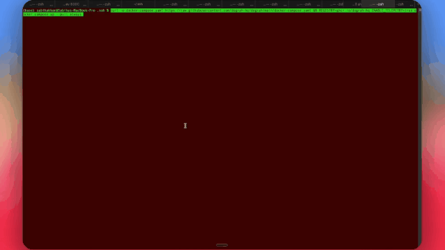
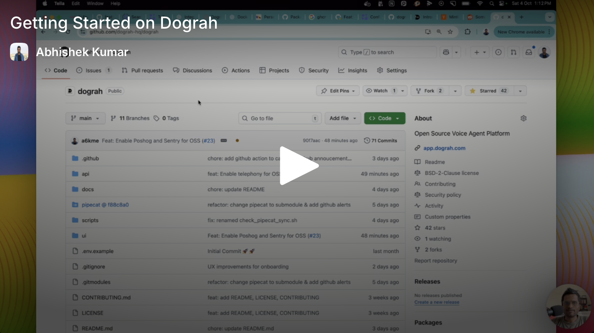

# Zenvoice

> 🧩 **About this deployment:** Zenvoice is a whitelabeled deployment built on top of the open-source [Dograh AI](https://github.com/dograh-hq/dograh) project, licensed under the BSD 2-Clause License.

**The open-source, self-hostable alternative to Vapi & Retell** — build production voice agents with a drag-and-drop workflow builder. From zero to a working bot in under 2 minutes.

<p align="center">
  <a href="https://app.zenvoice.example">
    
  </a>
  &nbsp;
  <a href="#-get-started">
    
  </a>
</p>

<p align="center">
  <a href="https://docs.zenvoice.example">📖 Docs</a> &nbsp;·&nbsp;
  <a href="LICENSE">📜 BSD 2-Clause</a> &nbsp;·&nbsp;
  <a href="README.zh-CN.md">🌐 中文</a> &nbsp;·&nbsp;
  <a href="README.ja-JP.md">🌐 日本語</a>
</p>

<p align="center">
  
</p>

- **100% open source**, self-hostable — no vendor lock-in, unlike Vapi or Retell
- **Full control & transparency** — every line of code is open, with flexible LLM / TTS / STT integration
- **Maintained by YC alumni and exit founders**, committed to keeping voice AI open

## 🎥 Featured

<div align="center">
  <a href="https://www.youtube.com/watch?v=xD9JEvfCH9k">
    
  </a>
  <br>
  <em>Featured by <strong>Better Stack</strong> — a hands-on look at Zenvoice</em>
</div>

<details>
<summary>📺 Prefer a 2-minute product walkthrough? Click here.</summary>

<div align="center">
  <a href="https://youtu.be/9gPneyf9M9w">
    
  </a>
</div>

</details>

## ⚖️ Zenvoice vs Vapi vs Retell

An honest comparison on the axes that matter most to teams evaluating voice AI platforms.

|  | **Zenvoice** | **Vapi** | **Retell** |
|---|---|---|---|
| **License** | BSD 2-Clause (open source) | Proprietary | Proprietary |
| **Self-hostable** | ✅ Yes — one Docker command | ❌ SaaS only | ❌ SaaS only |
| **Pricing** | Free (self-host) · usage-based (cloud) | Per-minute SaaS | Per-minute SaaS |
| **Bring your own LLM / STT / TTS** | ✅ Any provider, or use Zenvoice's stack | Configurable within their integrations | Configurable within their integrations |
| **Source-level customization** | ✅ Every line is yours to modify | ❌ Closed source | ❌ Closed source |
| **Data residency** | Your infra, your rules | Their cloud | Their cloud |
| **Vendor lock-in** | None | Full | Full |


## 🚀 Get Started

##### Download and setup Zenvoice on your Local Machine

> **Note**
> We collect anonymous usage data to improve the product. You can opt out by setting `ENABLE_TELEMETRY=false` before running the startup script.

> **Note**
> If you wish to run the platform on a remote server instead, checkout our [Documentation](https://docs.zenvoice.example/deployment/docker#option-2:-remote-server-deployment)

<!-- TODO: once this fork lives at its own GitHub repo, update the raw.githubusercontent.com URLs below (and DEPLOY_BUNDLE_REPO in scripts/lib/setup_common.sh) to point at it instead of upstream dograh-hq/dograh. -->
```bash
curl -o docker-compose.yaml https://raw.githubusercontent.com/dograh-hq/dograh/main/docker-compose.yaml && curl -o start_docker.sh https://raw.githubusercontent.com/dograh-hq/dograh/main/scripts/start_docker.sh && chmod +x start_docker.sh && ./start_docker.sh
```

> **Note**
> First startup may take 2-3 minutes to download all images. Once running, open http://localhost:3010 to create your first AI voice assistant!
> For common issues and solutions, see 🔧 **[Troubleshooting](docs/getting-started/troubleshooting.mdx)**.

### 🎙️ Your First Voice Bot

1. Open [http://localhost:3010](http://localhost:3010) in your browser.
2. Pick **Inbound** or **Outbound**, name your bot (e.g. _Lead Qualification_), and describe the use case in 5–10 words (e.g. _Screen insurance form submissions for purchase intent_).
3. Click **Web Call** — you're talking to your bot.

> 🔑 **No API keys needed.** Zenvoice ships with auto-generated keys and its own LLM / TTS / STT stack. Connect your own keys for LLM, TTS, STT, or Telephony (e.g. Twilio, Vonage, Telnyx) anytime.

## Features

### Voice Capabilities

- Telephony: Built-in telephony integration like Twilio, Vonage, Vobiz, Cloudonix (easily add others), with support for transferring calls to human agents
- Languages: English support (expandable to other languages)
- Custom Models: Bring your own TTS/STT models
- Real-time Processing: Low-latency voice interactions

### Developer Experience

- Zero Config Start: Auto-generated API keys for instant testing
- Python-Based: Built on Python for easy customization
- Docker-First: Containerized for consistent deployments
- Modular Architecture: Swap components as needed

### Testing & Quality

- **Test Mode**: Try your agent end-to-end before publishing, with no production calls or data affected
- **In-Dashboard Web Calls**: Talk to your bot directly while building — no telephony setup required
- **QA Node**: A built-in workflow node that analyzes prompt quality across your other nodes

## Deployment Options

### Local Development

Refer [Local Setup](https://docs.zenvoice.example/contribution/setup)

### Self-Hosted Deployment

For detailed deployment instructions including remote server setup with HTTPS, see our [Docker Deployment Guide](https://docs.zenvoice.example/deployment/docker).

### Cloud Version

Visit [https://zenvoice.example](https://zenvoice.example/) for our managed cloud offering.

## 📚Documentation

You can go to [https://docs.zenvoice.example](https://docs.zenvoice.example/) for our documentation.

## 📦 SDKs

- **Python SDK** — [pypi.org/project/dograh-sdk](https://pypi.org/project/dograh-sdk/)
- **Node SDK** — [npmjs.com/package/@dograh/sdk](https://www.npmjs.com/package/@dograh/sdk)

## 🤝Community & Support

- **GitHub Discussions** — share use cases, ask questions, swap workflow recipes.
- **GitHub Issues** — report bugs or request features.

> Replace this with a link to your own GitHub repository / community channel.

## 🙌 Contributing

We love contributions! Zenvoice is 100% open source and we intend to keep it that way.

### Getting Started

- Fork the repository
- Create your feature branch (git checkout -b feature/AmazingFeature)
- Commit your changes (git commit -m 'Add some AmazingFeature')
- Push to the branch (git push origin feature/AmazingFeature)
- Open a Pull Request

## 📄 License

Zenvoice is licensed under the [BSD 2-Clause License](LICENSE) - the same license as projects that were used in building it, ensuring compatibility and freedom to use, modify, and distribute.

## 🏢 About

**Zenvoice** is a whitelabeled deployment built on the open-source Dograh AI platform, originally created by the team at Dograh (Zansat Technologies Private Limited) — YC alumni and exit founders committed to keeping voice AI open and accessible to everyone.

<br><br><br>

  <p align="center">
    <a href="https://app.zenvoice.example">☁️ Try Cloud Version</a>
  </p>
