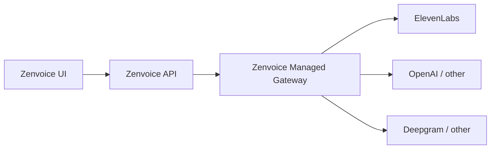

# Option B — Zenvoice Managed Gateway

Build a **separate Managed AI service** that Zenvoice talks to (same role as Dograh MPS today). ElevenLabs (and later other vendors) stay **server-side only**; users only see Zenvoice.

**Status:** Planning document (not yet implemented)  
**Related assets:**

- Curated catalogue: `elevenlabs-indian-voices-curated.json` (121 voices)
- Full research dump: `elevenlabs-indian-voices.json` (~3968 voices)
- Current Managed UI still points at Dograh when `MPS_API_URL=https://services.dograh.com`

---

## Goals

- Models → **Managed** works without Dograh
- Users get a **Zenvoice Service Key**, never vendor keys
- Voice catalogue = curated 121 (expand later)
- Browser/UI never shows “ElevenLabs”, vendor URLs, or raw vendor IDs
- Swap TTS/LLM/STT later without UI changes

---

## High-level architecture



| Piece | Role |
|-------|------|
| **Zenvoice UI/API** | Product: workflows, models config, Service Keys UX |
| **Managed Gateway (new)** | Voices, TTS/STT/LLM proxy, key auth, usage metering |
| **Vendor APIs** | Internal only; keys in gateway env |

Set `MPS_API_URL` → your gateway (keep Zenvoice’s existing MPS client shapes where possible to avoid a huge rewrite).

---

## Why Option B (vs thin proxy in the API)

| | A – thin proxy inside Zenvoice API | B – separate Managed service |
|--|-----------------------------------|------------------------------|
| Scale / multi-tenant | Mixes product API with vendor billing, quotas, TTS load | Clean split: Studio vs AI gateway |
| Swap vendors later | Painful (ElevenLabs baked into app) | Swap TTS behind the gateway; UI unchanged |
| Service Keys / credits | Bolted onto app | Natural home for keys, metering, limits |
| Hide ElevenLabs | Possible, but easy to leak in errors/UI | Easier: one place that only speaks **Zenvoice** names |

**Long run:** Option B. Use Option A only as a short bridge if needed.

---

## Phase 0 — Decisions (1–2 days)

1. Gateway stack: FastAPI (matches current stack) or Node
2. Deploy: same Docker Compose initially, later separate host/K8s
3. ID scheme: map `zv_voice_…` → internal ElevenLabs `voice_id` (never expose `xi` / `eleven` in public JSON)
4. Auth: Service Keys issued/validated by gateway (OSS: one key per user; cloud: org-scoped)
5. Confirm ToS: reselling/wrapping ElevenLabs under your brand (billing + disclosure obligations)

---

## Phase 1 — Gateway skeleton + voices (week 1)

**Deliverable:** Managed Select Voice shows **your** 121 voices, no Dograh.

| Work | Detail |
|------|--------|
| New service `managed-gateway/` | Health, config, Docker service |
| `GET /api/v1/voice-proxy/dograh/voices` | Compatible path Zenvoice already calls; body branded Zenvoice |
| Load curated JSON | `elevenlabs-indian-voices-curated.json` |
| Rewrite public fields | `voice_id` → `zv_…`, strip `preview_url` vendor hosts → **your** preview proxy |
| `GET /preview/{zv_id}` | Stream audio via gateway (hides GCS/ElevenLabs URLs) |
| Wire env | `MPS_API_URL=http://managed-gateway:8080` |
| Clear Dograh | Remove `services.dograh.com` |

**Hide vendors:** no `elevenlabs` in provider labels, errors, or response payloads.

---

## Phase 2 — Service Keys (week 1–2)

**Deliverable:** Developers → Service Key works against **you**.

| Work | Detail |
|------|--------|
| `POST/GET/DELETE /api/v1/service-keys/` | Same shapes Zenvoice expects |
| Store hashed keys + metadata | Postgres (shared or gateway DB) |
| Validate `Authorization: Bearer …` | Prefer Zenvoice prefix, e.g. `zvsk_…` |
| OSS rule | One active key (match current UI) |
| Stop calling Dograh for keys | Zenvoice `mps_service_key_client` → your gateway |

---

## Phase 3 — TTS (week 2–3) — first real Managed call

**Deliverable:** Test call speaks with curated voice using **your** ElevenLabs key.

| Work | Detail |
|------|--------|
| Operator secret | `ELEVENLABS_API_KEY` only on gateway |
| WebSocket/HTTP TTS | Match what `DograhTTSService` expects, or adapt Zenvoice `service_factory` to a thinner Zenvoice TTS client |
| Map `zv_…` → ElevenLabs id | Internal table only |
| Library voices | May need “add to workspace” once per voice (`public_owner_id`) on sync |
| Errors | Map vendor errors → generic “Managed TTS unavailable” |

**Optional bridge:** if Dograh WS protocol is heavy, implement a **Zenvoice-native TTS** path in API and skip full MPS WS parity for v1.

---

## Phase 4 — STT + LLM (week 3–5)

**Deliverable:** Full Managed pipeline (STT → LLM → TTS) on your keys.

| Work | Detail |
|------|--------|
| STT proxy | Deepgram/Assembly/etc. behind gateway |
| LLM proxy | OpenAI-compatible `/api/v1/llm` (Zenvoice already points Dograh LLM here) |
| Single Managed config | Keep UI mode `dograh` internally or rename later to `managed` (schema migration) |
| Correlation IDs | Per-run usage tracking |

---

## Phase 5 — Metering & hardening (week 5–7)

| Work | Detail |
|------|--------|
| Usage ledger | chars/minutes/tokens per Service Key / org |
| Quotas | Soft limits for OSS; credits later if you sell Managed |
| Rate limits | Per key |
| Observability | Logs/metrics **without** logging full vendor payloads or keys |
| Admin | Operator UI or env-only for vendor keys + catalogue refresh |

---

## Phase 6 — Product polish

- Rename internal `dograh` → `managed` in API/UI when safe
- Sync job: refresh curated list from ElevenLabs library (still map to `zv_…`)
- Multi-vendor TTS failover (Cartesia/etc.) behind same `zv_` IDs where possible
- Legal: privacy policy says “subprocessors” without naming in UI if counsel prefers

---

## Repo / Compose sketch

```text
managed-gateway/
  app/          # FastAPI
  data/voices.curated.json
  Dockerfile
docker-compose.yaml
  + managed-gateway service
  API: MPS_API_URL=http://managed-gateway:8080
  gateway: ELEVENLABS_API_KEY=...
```

Do **not** commit vendor keys or the raw full ~3900 list into git if avoidable; curated JSON is OK.

---

## Hide ElevenLabs checklist (non-negotiable)

- [ ] UI copy: Zenvoice Managed only
- [ ] Public voice IDs: `zv_…`
- [ ] Previews via your domain
- [ ] No vendor names in API errors
- [ ] Browser never calls `api.elevenlabs.io`
- [ ] Network tab: only your API / gateway

---

## What you already have (reuse)

- Curated catalogue: `elevenlabs-indian-voices-curated.json`
- Zenvoice MPS client + Managed tab + Service Keys UI
- `MPS_API_URL` injection path

### Voice curation rule (Option 1)

Already applied for the curated file:

1. Pool: `language=hi` OR Indian/regional accents OR workspace
2. Top 50 female by `usage_character_count_1y`
3. Top 50 male by `usage_character_count_1y`
4. Plus workspace premade voices
5. Result: **121 unique voices**

Note: ElevenLabs shared-voices API has **no star/user rating filter**. Closest signals: `featured`, `category`, `sort=trending|cloned_by_count|usage_character_count_1y`. Field `rate` is a pricing multiplier, not quality.

---

## Suggested v1 scope (ship first)

1. Gateway + curated voices + preview proxy
2. Service Keys on gateway
3. TTS only for Managed
4. Disconnect Dograh

Defer STT/LLM/credits until TTS path is solid.

---

## Risks

| Risk | Mitigation |
|------|------------|
| Dograh WS protocol hard to clone | Prefer Zenvoice-native TTS client for v1 |
| Library voices need “add” step | Batch-add on deploy/sync |
| Cost spikes | Quotas + usage caps |
| Key leak | Gateway-only env; rotate; never in UI |

---

## Immediate next implementation step

**Phase 1** — scaffold `managed-gateway`, serve curated voices under MPS-compatible routes, point `MPS_API_URL` at it.
